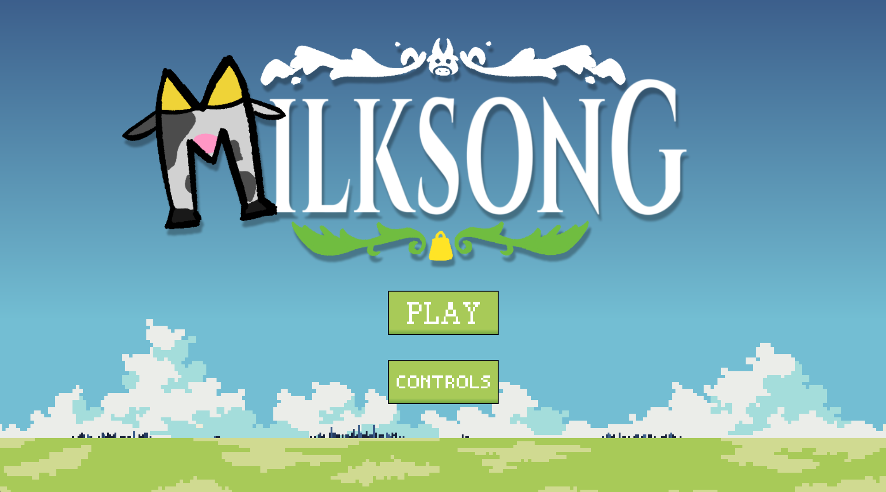
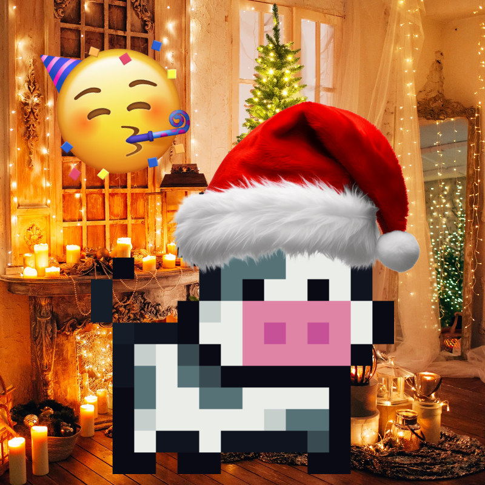
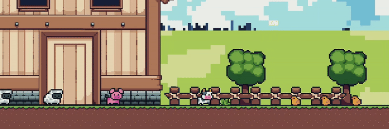
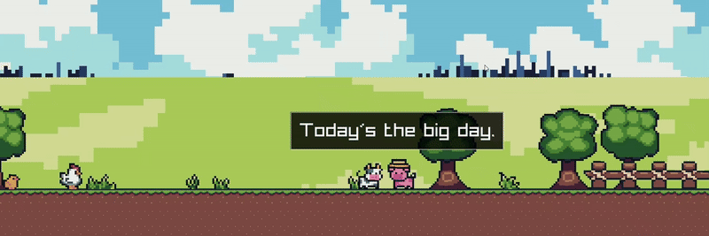

# Milksong	

 

 

Add to your wishlist | Follow | Ignore
--- | --- | ---

---

 

### BUY MILKSONG

$0.99 | Add to cart 
--- | ---

 

### Recent Events & Announcements
---

 

Spike 3 is complete for the holidays! 

 

### Reviews
---

> "Pretty darn <em>amoozing</em>."

5/5 - <strong>Local Cow</strong>

 

> "⏁⊑⟟⌇ ⟟⌇ ⏃ ☊⍜⍜⌰ ☌⏃⋔⟒"

 5/5 - <strong>Mr. Alien</strong>

 

> "Get back in the barn."

 1/5 - <strong>Angry Farmer</strong>

 
 

### About Game
---

Milksong is a 2D action platformer

Lorem ipsum dolor sit amet, consectetur adipiscing elit, sed do eiusmod tempor incididunt ut labore et dolore magna aliqua. Ut enim ad minim veniam, quis nostrud exercitation ullamco laboris nisi ut aliquip ex ea commodo consequat. Duis aute irure dolor in reprehenderit in voluptate velit esse cillum dolore eu fugiat nulla pariatur. Excepteur sint occaecat cupidatat non proident, sunt in culpa qui officia deserunt mollit anim id est laborum.

 

### Game Features
---

- <strong>Explore Levels</strong>
  
Classic side-scrolling with player movement and jumping. Traverse each stage and progress through the narrative of Milksong, through interacting with the environment and obstacles that are present.
 
- <strong>Fight and Defeat Enemies</strong>
  
Lorem ipsum dolor sit amet, consectetur adipiscing elit, sed do eiusmod tempor incididunt ut labore et dolore magna aliqua. Ut enim ad minim veniam, quis nostrud exercitation ullamco laboris nisi ut aliquip ex ea commodo consequat. Duis aute irure dolor in reprehenderit in voluptate velit esse cillum dolore eu fugiat nulla pariatur. Excepteur sint occaecat cupidatat non proident, sunt in culpa qui officia deserunt mollit anim id est laborum.

- <strong>Interact with NPCs</strong>
  
Lorem ipsum dolor sit amet, consectetur adipiscing elit, sed do eiusmod tempor incididunt ut labore et dolore magna aliqua. Ut enim ad minim veniam, quis nostrud exercitation ullamco laboris nisi ut aliquip ex ea commodo consequat. Duis aute irure dolor in reprehenderit in voluptate velit esse cillum dolore eu fugiat nulla pariatur. Excepteur sint occaecat cupidatat non proident, sunt in culpa qui officia deserunt mollit anim id est laborum.

- <strong>Obtain and Use Powerups</strong>
  
Lorem ipsum dolor sit amet, consectetur adipiscing elit, sed do eiusmod tempor incididunt ut labore et dolore magna aliqua. Ut enim ad minim veniam, quis nostrud exercitation ullamco laboris nisi ut aliquip ex ea commodo consequat. Duis aute irure dolor in reprehenderit in voluptate velit esse cillum dolore eu fugiat nulla pariatur. Excepteur sint occaecat cupidatat non proident, sunt in culpa qui officia deserunt mollit anim id est laborum.
  
- <strong>Art and Animations</strong>
  
Lorem ipsum dolor sit amet, consectetur adipiscing elit, sed do eiusmod tempor incididunt ut labore et dolore magna aliqua. Ut enim ad minim veniam, quis nostrud exercitation ullamco laboris nisi ut aliquip ex ea commodo consequat. Duis aute irure dolor in reprehenderit in voluptate velit esse cillum dolore eu fugiat nulla pariatur. Excepteur sint occaecat cupidatat non proident, sunt in culpa qui officia deserunt mollit anim id est laborum.

- <strong>Totally Original (Not) Music</strong>
  
Milksong's exsquisite soundtrack is graciously made by the composers of existing titles, Stardew Valley, Animal Crossing: New Horizons, and Dark Souls

 